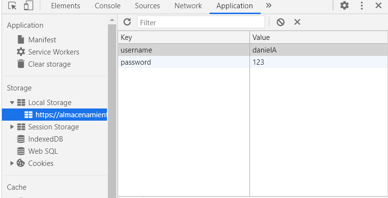
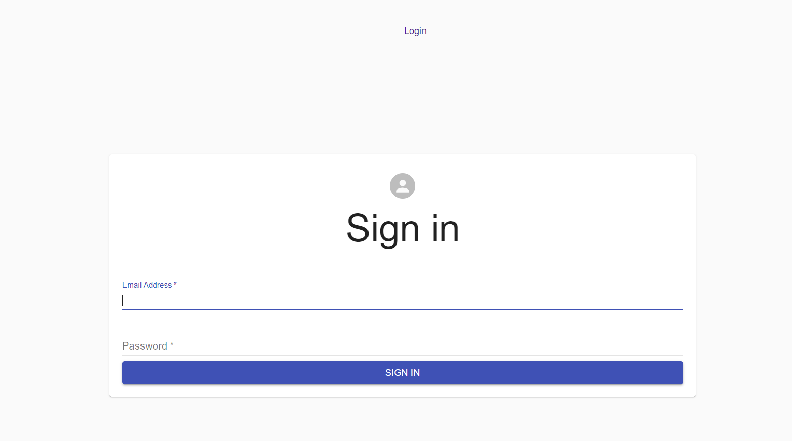
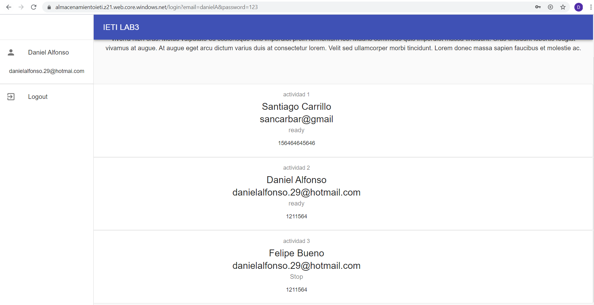
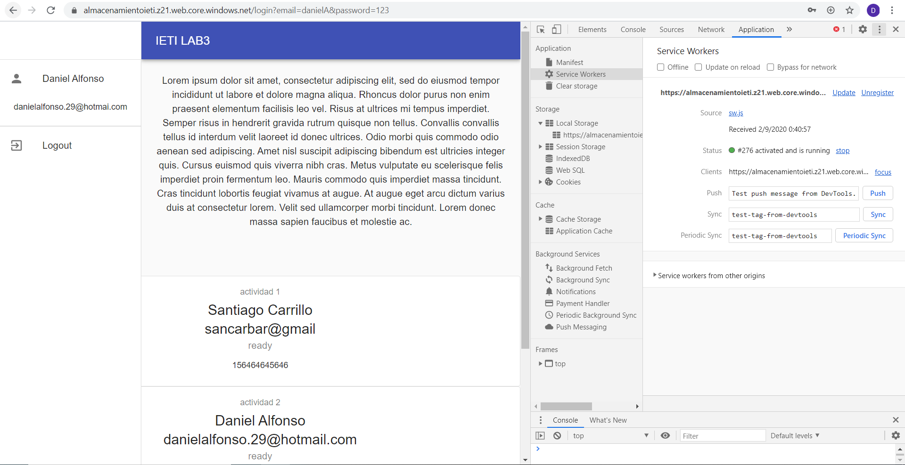
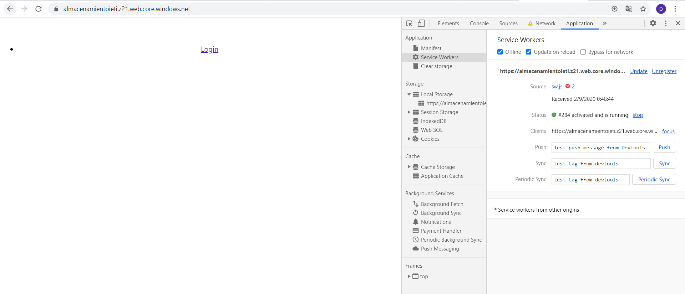
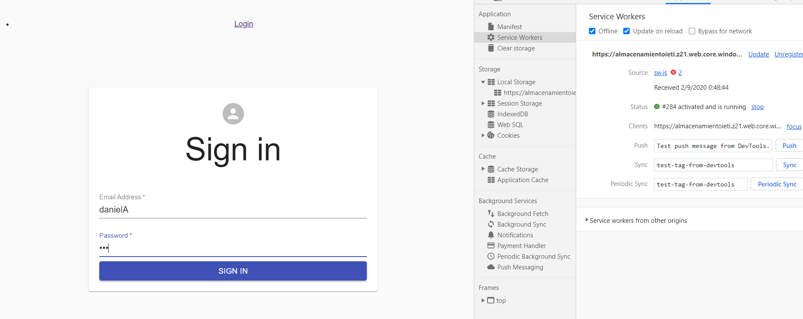
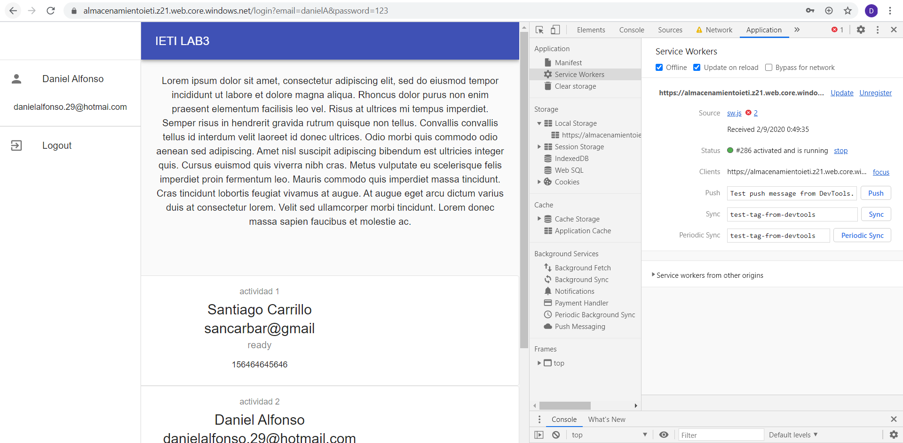
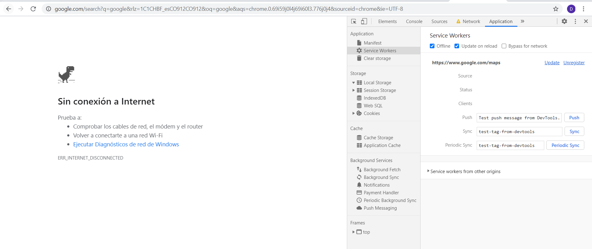

# Autor: Daniel Felipe Alfonso Bueno
## Código de honor: 

------
Debes seguir el Código de honor del ingeniero de sistemas para defender el estándar de integridad académica de la ECI:

- Tus respuestas a tareas, cuestionarios y exámenes deben ser tu propio trabajo (excepto para las tareas que permiten explícitamente la colaboración).

- No puedes compartir tus soluciones de tareas, cuestionarios o exámenes con otra persona a menos que el instructor lo permita explícitamente. Esto incluye cualquier cosa escrita por ti, como también cualquier solución oficial proporcionada por el docente o el monitor del curso.

- No puedes participar en otras actividades que mejorarán de manera deshonesta tus resultados o que mejorarán de manera deshonesta o dañarán los resultados de otras personas.

## Uso del repositorio: 

Clonamos nuestro repositorio con el siguiente comando: 
~~~
git clone https://github.com/DanielAlfonso17/IETI-LAB3.git
~~~

Entramos a nuestra carpeta del proyecto y ejecutamos para instalar todas las dependencias del proyecto
~~~
npm install
~~~
Ejecutamos npm start para ver nuestro proyecto en funcionamiento 
~~~
npm start
~~~
Veremos la aplicación corriendo en un ambiente local, también se dispone de la app desplegada en la nube en dos servicios diferentes

[¡Aplicación desplegada en Heroku!](https://young-ravine-23092.herokuapp.com/)

[¡Aplicación desplegada en MicrosoftAzure!](https://almacenamientoieti.z21.web.core.windows.net/)

El inicio de sesión lo estamos manejando con usuario en localstorage el cual es

Username: danielA

Password: 123

Podemos observarlo abriendo la consola del navegador dando en el apartado aplicación 

#### Implementación del Login con Material

#### Implementación de Drawer Navigation y Cards de tareas

#### Implementación de service worker

Ahora si trabajamos sin conexión, seleccionando offline en el checkbox funciona con normalidad la aplicación se realizó una prueba de hacer logout e intentar volver a entrar
y funciona de manera correcta sin conexión y después cuando se quiere acceder a algún sitio como google, no hay conexión se adjunta evidencia

